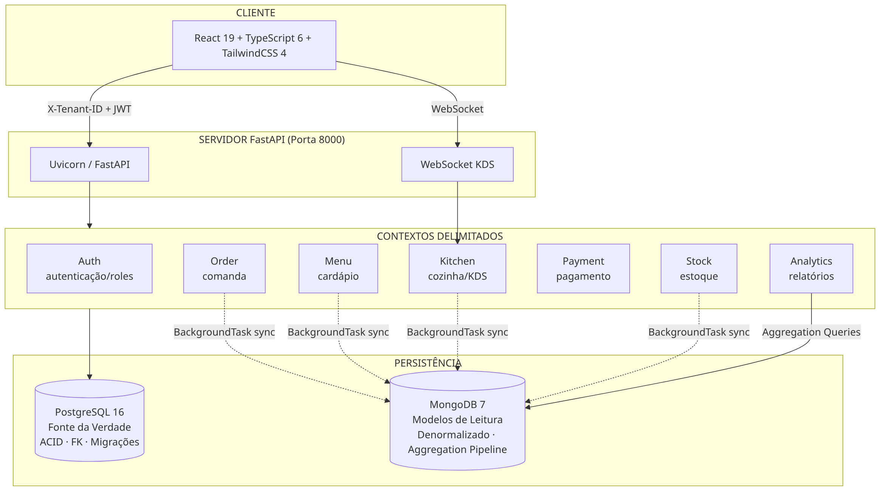
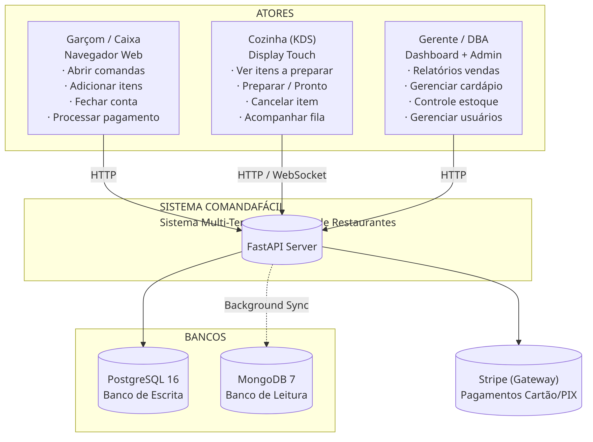
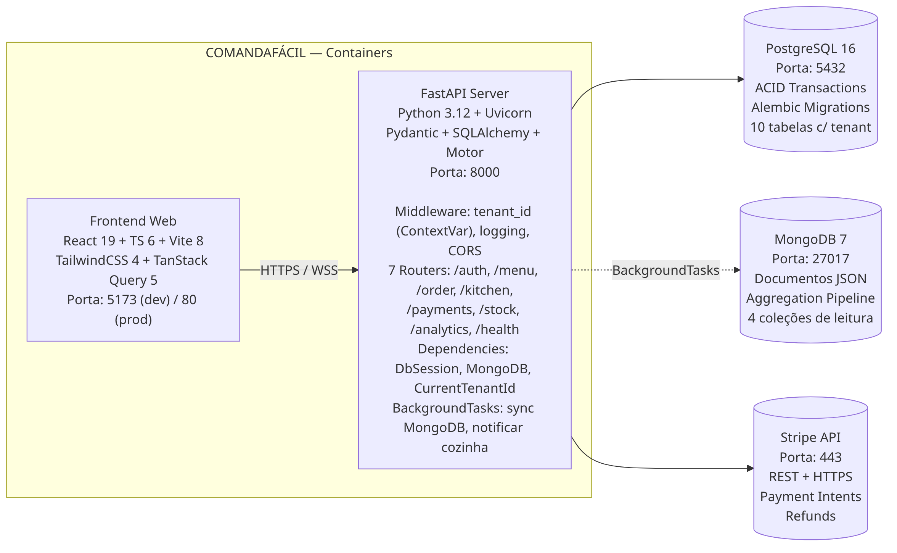
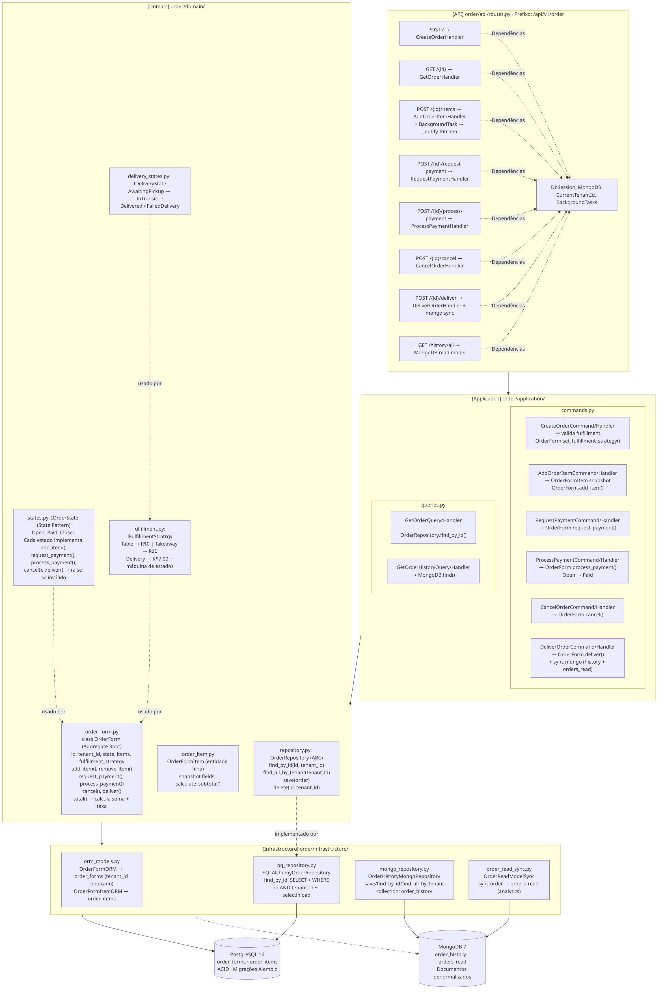
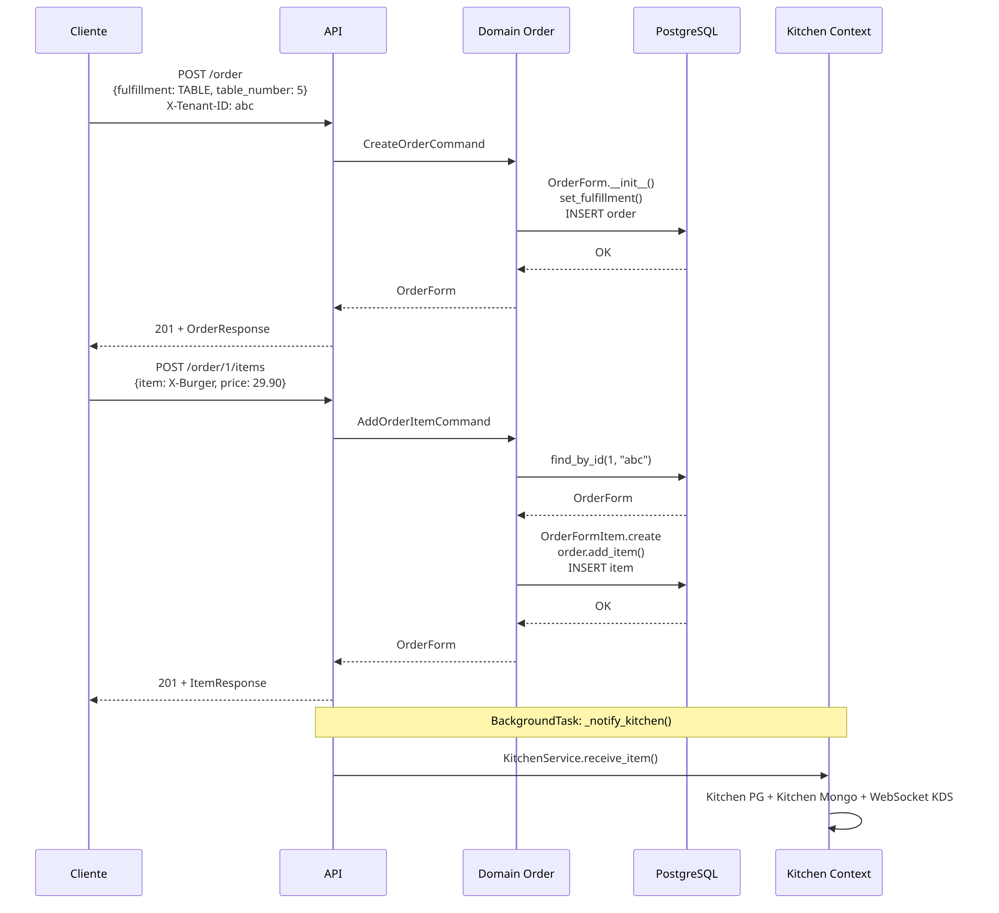
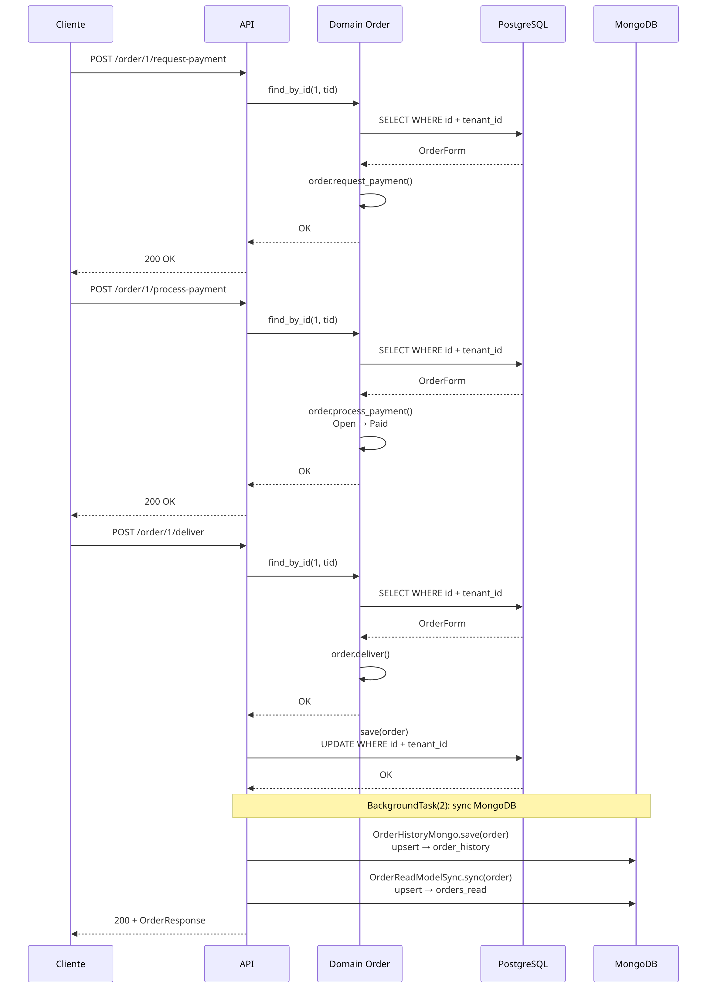

# Relatório Técnico — ComandaFácil

## Sistema Multi-Tenant de Gestão de Restaurantes

---

## 1. Introdução

### 1.1. Escopo do Projeto

O **ComandaFácil** é um sistema de gestão para franquias de alimentação que oferece funcionalidades de:
- Gerenciamento de cardápios e listas de preços
- Abertura e fechamento de comandas (pedidos) com suporte a balcão, mesa e delivery
- Sistema de Display de Cozinha (KDS) com atualizações em tempo real via WebSocket
- Processamento de pagamentos (dinheiro, cartão, PIX) com integração Stripe
- Controle de estoque com movimentação e alertas de nível mínimo
- Painéis analíticos com agregações em tempo real
- Autenticação e autorização baseada em papéis (gerente, garçom, cozinha, caixa)

### 1.2. Stack Tecnológica

| Camada | Tecnologia | Versão |
|--------|-----------|--------|
| Runtime Backend | Python | ≥ 3.12 |
| Framework Web | FastAPI | ≥ 0.115.0 |
| ORM (escrita) | SQLAlchemy | ≥ 2.0.0 |
| Driver PostgreSQL | asyncpg | ≥ 0.29.0 |
| Migrações | Alembic | ≥ 1.13.0 |
| Driver MongoDB | Motor | ≥ 3.5.0 |
| Frontend | React | ≥ 19.0.0 |
| Build Frontend | Vite | ≥ 8.0.0 |
| TypeScript | TypeScript | ≥ 6.0.0 |
| Banco Escrita | PostgreSQL | 16 (Docker) |
| Banco Leitura | MongoDB | 7 (Docker) |
| Testes Unitários | Pytest | ≥ 8.0 |
| Testes E2E | Playwright | ≥ 1.47.0 |
| Testes Mutantes | Mutmut + Stryker | ≥ 3.1.0 |
| Linter Backend | Ruff | ≥ 0.9.0 |
| Type Check | Pyright | strict |
| Linter Frontend | Biome | ≥ 2.4.0 |
| Contêineres | Docker Compose | -- |

### 1.3. Arquitetura Geral

O sistema segue **Domain-Driven Design (DDD)** com **CQRS** (Command Query Responsibility Segregation) utilizando dois bancos de dados:



### 1.4. Multi-Tenant

O isolamento entre franquias é feito via header HTTP `X-Tenant-ID`:

1. **Middleware** extrai o header e injeta em `ContextVar[str]`
2. **CurrentTenantId** depende da ContextVar (tipo `str`)
3. **Domínio**: toda entidade carrega `tenant_id: Final[str]`
4. **Repositórios**: todas as queries filtram por `tenant_id`
5. **Logs**: arquivos separados por tenant em `logs/franquias/{tenant_id}/`

---

## 2. Estrutura do Projeto

```
ComandaFacil/
├── backend/
│   ├── app/
│   │   ├── auth/           # Autenticação e Autorização
│   │   ├── menu/           # Cardápios e Listas de Preço
│   │   ├── order/          # Comandas (Aggregate Root central)
│   │   ├── kitchen/        # Cozinha (KDS, WebSocket)
│   │   ├── payment/        # Pagamentos (Stripe + Dinheiro)
│   │   ├── stock/          # Estoque e Movimentações
│   │   ├── analytics/      # BI e Agregações MongoDB
│   │   ├── shared/         # Core compartilhado (Money, Base ORM, etc.)
│   │   ├── dependencies.py # Injeção de Dependência FastAPI
│   │   ├── main.py         # Setup do FastAPI (middleware, routers)
│   │   └── settings.py     # Configurações (pydantic-settings)
│   ├── alembic/            # Migrações PostgreSQL
│   ├── tests/
│   │   ├── unit/           # Testes unitários síncronos
│   │   └── integration/    # Testes de integração (SQLite/Mongo Mock)
│   ├── pyproject.toml
│   └── Dockerfile
├── frontend/
│   ├── src/
│   │   ├── shared/         # lib, hooks, componentes, tipos
│   │   └── features/       # auth, menu, order, kitchen, stock, analytics
│   ├── tests/              # e2e, property, unit
│   ├── package.json
│   └── vite.config.ts
├── docker-compose.yml      # PostgreSQL + MongoDB
├── Makefile                # Comandos de desenvolvimento
└── AGENTS.md               # Guia do agente AI
```

Cada contexto segue a estrutura DDD:

```
app/{contexto}/
├── domain/          # Lógica pura (sem I/O, sem imports externos)
│   ├── entidade.py         # Aggregate Root + Entidades
│   ├── value_object.py     # Objetos de Valor (frozen dataclass)
│   ├── repository.py       # Interface do Repositório (ABC ou Protocol)
│   ├── enums.py            # Enumeradores
│   └── states.py           # Padrão State (máquina de estados)
├── application/
│   ├── commands.py         # Comandos + Handlers (escrita)
│   └── queries.py          # Queries + Handlers (leitura)
├── infrastructure/
│   ├── orm_models.py       # Modelos SQLAlchemy
│   ├── repositories.py     # Implementação dos Repositórios
│   └── mongo_sync.py       # Sincronização MongoDB (se aplicável)
└── api/
    └── routes.py           # Endpoints FastAPI (delegam para application)
```

---

## 3. Diagramas C4

### 4.1. Diagrama de Contexto (Nível 1)



### 4.2. Diagrama de Container (Nível 2)



### 4.3. Diagrama de Componente (Nível 3) — Order Context



---

## 4. Fluxos de Dados Principais

### 5.1. Fluxo de Criação de Comanda com Item



### 5.2. Fluxo de Fechamento de Comanda



---

## 5. Cronograma (02/jun → 12/jun)

### Fase 1: Fundação (02/jun — 03/jun)

| Período | Atividades | Membros |
|---------|-----------|---------|
| 02/jun | Setup do monorepo (backend + frontend + Docker + Docker Compose) | Alerrandro |
| 02/jun | Setup FastAPI + SQLAlchemy + Alembic + Motor + shared kernel | Alerrandro |
| 02/jun | Setup frontend (React + Vite + TS + Tailwind + TanStack Query) | Luiz |
| 03/jun | Setup CI/CD (GitHub Actions, pre-commit, lint, typecheck) | Eduardo |
| 03/jun | Configuração de testes (Pytest, Vitest, Playwright, Mutmut, Stryker) | Eduardo |
| 03/jun | ADRs + documentação inicial | Alerrandro |

### Fase 2: Contextos Core (04/jun — 07/jun)

| Período | Atividades | Membros |
|---------|-----------|---------|
| 04/jun | Contexto Auth: domínio + ORM + repositórios + commands + rotas + testes | Eduardo |
| 05/jun | Contexto Menu: domínio + ORM + repositórios + commands + rotas + MongoDB sync | Luiz |
| 05/jun-06/jun | Contexto Order: domínio (OrderForm, States, Fulfillment, Delivery) + ORM + repositórios | Alerrandro |
| 06/jun | Contexto Order: commands + queries + handlers + rotas REST | Alerrandro |
| 07/jun | Contexto Kitchen: domínio + WebSocket Manager + rotas HTTP/WS + testes | Luiz |

### Fase 3: Contextos de Suporte (07/jun — 09/jun)

| Período | Atividades | Membros |
|---------|-----------|---------|
| 07/jun-08/jun | Contexto Payment: domínio + StripeGateway + rotas | Alerrandro |
| 08/jun | Contexto Stock: domínio + ORM + repositórios + commands + rotas | Luiz |
| 08/jun-09/jun | Contexto Analytics: value objects + aggregation pipelines + queries + rotas | Kelry |

### Fase 4: Integração e Isolamento (09/jun — 11/jun)

| Período | Atividades | Membros |
|---------|-----------|---------|
| 09/jun | Integração Order → Kitchen (background task) + MongoDB sync | Alerrandro |
| 10/jun | Multi-tenant isolation (tenant_id em todas entidades/queries — Order, Kitchen, Menu) | Alerrandro |
| 10/jun | Testes de integração Stock + Analytics (testcontainers) | Luiz, Kelry |
| 11/jun | Testes de mutação (3223 mutantes, cobertura 7 contextos) | Eduardo |

### Fase 5: Analytics e Finalização (11/jun — 12/jun)

| Período | Atividades | Membros |
|---------|-----------|---------|
| 11/jun | Wire analytics collections: orders_read, stock_read, kitchen_read | Alerrandro, Luiz |
| 11/jun | Payment queries layer (GetPaymentByOrderHandler) | Alerrandro |
| 11/jun-12/jun | Dashboards analíticos (frontend) | Kelry |
| 12/jun | Testes E2E (Playwright) + Testes de propriedade (Hypothesis + fast-check) | Eduardo |
| 12/jun | Testes de mutação finais, revisão de cobertura | Eduardo |
| 12/jun | Documentação final, relatório técnico, handoff | Alerrandro |

---
