# Relatório Técnico de Engenharia: Ecossistema ComandaFacil

> **Autor:** Equipe ComandaFacil  
> **Versão:** 2.0  
> **Data:** Junho 2026  
> **Status:** Documento técnico definitivo

---

## Sumário Executivo

O **ComandaFacil** é uma plataforma SaaS de missão crítica para operação de restaurantes e franquias. Este documento detalha a arquitetura técnica completa, com foco nos mecanismos de escrita (write-side) e leitura (read-side) que sustentam o sistema.

**Métricas do Ecossistema:**
| Dimensão | Valor |
|:---|:---|
| Bounded Contexts | 7 (auth, menu, order, kitchen, payment, stock, analytics) |
| Endpoints de API | 38+ |
| Tabelas PostgreSQL | 18 |
| Coleções MongoDB | 6 |
| Padrões de Design | 14+ (State, Strategy, CQRS, Composite, Repository, etc.) |
| Linhas de Código (backend) | ~8.000+ (Python 3.12) |
| Linhas de Código (frontend) | ~7.500+ (TypeScript/React 19) |

---

## 1. Contextualização e Arquitetura

### 1.1. Visão Geral do Ecossistema

O ComandaFacil é construído como um **monorepo** com dois artefatos principais:

```
ComandaFacil/
├── backend/          ← Python 3.12 + FastAPI + SQLAlchemy 2.0 (Async)
├── frontend/         ← React 19 + Vite 8 + TypeScript 6.0 (Strict)
├── docker-compose.yml
└── Makefile
```

O sistema opera sob o paradigma **CQRS** (Command Query Responsibility Segregation), onde operações de escrita e leitura são fisicamente separadas entre dois bancos de dados distintos — PostgreSQL para escrita e MongoDB para leitura.

### 1.2. Stack Tecnológica

#### Backend

| Camada | Tecnologia | Versão | Justificativa |
|:---|:---|:---|:---|
| **Framework** | FastAPI | 0.115+ | Async nativo, OpenAPI automático, performance ASGI |
| **ORM** | SQLAlchemy 2.0 | 2.0+ | Async via asyncpg, type hints completos, migration Alembic |
| **Banco Write** | PostgreSQL | 15+ | ACID, integridade referencial, chaves estrangeiras |
| **Banco Read** | MongoDB | 7.0+ | Flexibilidade de schema, aggregations, write speed |
| **Motor Async** | Motor (MongoDB) | 3.0+ | Driver async para MongoDB via asyncio |
| **Validação** | Pydantic v2 | 2.0+ | Serialização automática, validação declarativa |
| **Settings** | pydantic-settings | 2.0+ | Configuração via variáveis de ambiente |
| **Migrations** | Alembic | 1.13+ | Migrations PostgreSQL com suporte async |
| **Testes** | pytest | 8.0+ | Async via pytest-asyncio, property-based via Hypothesis |
| **Linting** | Ruff | 0.4+ | Lint + format unificado, ~40 rulesets |
| **Type Checking** | Pyright | 1.1+ | Modo strict, detecção precoce de erros |

#### Frontend

| Camada | Tecnologia | Versão | Justificativa |
|:---|:---|:---|:---|
| **Framework** | React | 19.0+ | Server Components, Suspense, Performance |
| **Build** | Vite | 8.0+ | HMR instantâneo, tree-shaking, proxy reverso |
| **Linguagem** | TypeScript | 6.0+ (strict) | Type safety total, zero runtime errors |
| **Routing** | react-router-dom | 7.0+ | Nested routes, lazy loading, guards |
| **Server State** | React Query | 5.56+ | Cache, refetch, optimistic updates |
| **HTTP** | Axios | 1.7+ | Interceptors, cancel tokens, retry |
| **Charts** | Recharts | 3.8+ | Componentes declarativos SVG |
| **CSS** | Tailwind CSS v4 | 4.0+ | Utility-first, dark mode custom |
| **PWA** | vite-plugin-pwa | 1.3+ | Service Worker, offline support |
| **Testes** | Vitest + Playwright | 4.0+ / 1.47+ | Unit + E2E |
| **Linting** | Biome | 2.4+ | Lint + format unificado |

### 1.3. Multi-tenancy

O sistema opera com isolamento total entre franquias/restaurantes:

```
Requisição HTTP
    ↓
Header: X-Tenant-ID: "franquia_001"
    ↓
TenantMiddleware (ASGI)
    ↓
ContextVar[str] = "franquia_001"
    ↓
Injetado em TODOS os handlers via Depends(CurrentTenantId)
    ↓
Aplicado em TODAS as queries SQL (WHERE tenant_id = X)
E em TODAS as queries MongoDB ({tenant_id: X})
```

**Mecanismo de Propagação:**

O `ContextVar` do Python é usado porque FastAPI roda em asyncio — cada request tem seu próprio contexto de execução, garantindo que o tenant de um request não vaze para outro, mesmo com execução concorrente.

**Validação:**
- Regex: `^[a-zA-Z0-9_-]+$` — impede injeção de caracteres especiais
- Formato inválido retorna HTTP 400 Bad Request

### 1.4. Arquitetura DDD (Domain-Driven Design)

Cada Bounded Context segue a mesma estrutura de camadas:

```
app/{context}/
├── domain/              ← Lógica de negócio PURA (zero I/O)
│   ├── {aggregate}.py   ← Aggregate Root + Entidades
│   ├── value_objects.py ← Value Objects (imutáveis, frozen=True)
│   ├── states.py        ← State Pattern para máquinas de estados
│   ├── enums.py         ← Enumerações de domínio
│   └── repository.py    ← Interfaces abstratas (Ports)
├── application/         ← Orquestração (Commands, Queries, Handlers)
│   ├── commands.py      ← Command handlers (escrita → PostgreSQL)
│   └── queries.py       ← Query handlers (leitura → MongoDB)
├── infrastructure/      ← Implementações concretas (Adapters)
│   ├── orm_models.py    ← Modelos SQLAlchemy ORM
│   ├── pg_repository.py ← Repositórios SQLAlchemy (Write)
│   ├── *_sync.py        ← Sincronização PostgreSQL → MongoDB
│   └── mongo_*.py       ← Repositórios Motor (Read)
└── api/
    └── routes.py        ← Endpoints FastAPI (controllers finos)
```

**Regra Cardinal: Fluxo de Dependências**

```
API  →  Application  →  Domain
   ↓          ↓
Infrastructure (implements Domain interfaces)
```

**Import Validation Matrix:**

| Camada | Pode importar | NÃO pode importar |
|:---|:---|:---|
| `domain/` | `domain/*` (mesmo contexto), `app/shared/*` | ❌ `application/`, ❌ `infrastructure/`, ❌ `api/`, ❌ `sqlalchemy`, ❌ `motor`, ❌ `fastapi` |
| `application/` | `domain/*` (mesmo contexto), `app/shared/*` | ❌ `infrastructure/` (usa interfaces), ❌ `api/` |
| `infrastructure/` | `domain/*`, `application/*` (mesmo contexto), `app/shared/*`, `sqlalchemy`, `motor` | ❌ `api/` |
| `api/routes.py` | `application/*`, `app/dependencies.py`, `app/shared/*`, `fastapi` | ❌ `domain/*` diretamente, ❌ `infrastructure/*` diretamente |

**Regra de Ouro: Sem Imports Cross-Context**

```python
# ❌ PROIBIDO — Nunca importar de outro Bounded Context
from app.order.domain.entities import Order  # dentro de app/payment/

# ✅ CORRETO — Comunicação via Domain Events ou shared IDs
from app.shared.value_objects import OrderId  # ID compartilhado
```

### 1.5. Padrões de Design Aplicados

| Padrão | Onde | Implementação |
|:---|:---|:---|
| **State** | Order, Kitchen, Delivery, Payment | `IOrderState`, `IKitchenItemState`, `IDeliveryState` com classes concretas |
| **Strategy** | Fulfillment, Authorization | `IFulfillmentStrategy` (Table/Takeaway/Delivery), `IEmployeeStrategy` (Manager/Waiter/Cook/Cashier) |
| **CQRS** | Todos os contextos | Commands → PostgreSQL, Queries → MongoDB |
| **Repository** | Todos os contextos | Interfaces abstratas no domain, implementações SQLAlchemy na infrastructure |
| **Composite** | Stock | `CompositeStockItem` composto por filhos `StockItem` |
| **Aggregate Root** | Todos os contextos | `Employee`, `Menu`, `MenuItem`, `OrderForm`, `KitchenOrderItem`, `Payment`, `StockItem`, `Recipe` |
| **Value Object** | Global | `Email`, `Address`, `Money`, `MeasuredQuantity`, `GatewayResponse`, `DateRange` |
| **Facade** | Kitchen, Stock, Payment | `KitchenService`, `StockService`, `PaymentService` agregam múltiplos handlers |
| **Protocol** | Repositórios, Gateway | `StockItemRepository`, `IPaymentGateway` com `@runtime_checkable` |
| **Template Method** | Stock | `StockItem.get_balance()` abstrato, concreto em subclasses |
| **Observer** | Sync contexts | FastAPI `BackgroundTasks` dispara sincronização MongoDB após commit PostgreSQL |
| **Decorator** | Auth | `require_permission("ACTION")` injeta verificação de permissão |

### 1.6. Autenticação e Autorização

#### Fluxo de Login

```
POST /api/v1/auth/login
Body: {email, password, tenant_id}
    ↓
LoginHandler.validate_credentials()
    ↓
employee.check_password(password)
    → PBKDF2-SHA256 (100.000 iterações, salt aleatório)
    ↓
Verifica tenant ativo + employee tem role no tenant
    ↓
Cria Session (stateful) com secrets.token_urlsafe(32)
    → Expira em 60 minutos
    ↓
Retorna {session_id, expires_at}
```

#### Fluxo de Request Autenticado

```
Request com Authorization: Bearer {session_id}
    ↓
HTTPBearer (FastAPI dependency)
    ↓
get_current_session() → busca Session no PostgreSQL
    → Verifica expiração
    ↓
get_current_employee() → carrega Employee com todas as roles
    ↓
require_permission(action) → verifica Role + Strategy
    ↓
Dependency injection: CurrentEmployee disponível no handler
```

#### Matriz de Permissões (Strategy Pattern)

| Role | Ações Permitidas |
|:---|:---|
| **MANAGER** | Todas (busra absoluta) |
| **WAITER** | `CREATE_ORDER` |
| **COOK** | `PREPARE_ITEM` |
| **CASHIER** | `CLOSE_ORDER` |

### 1.7. Fluxo de Dados CQRS — Visão Geral

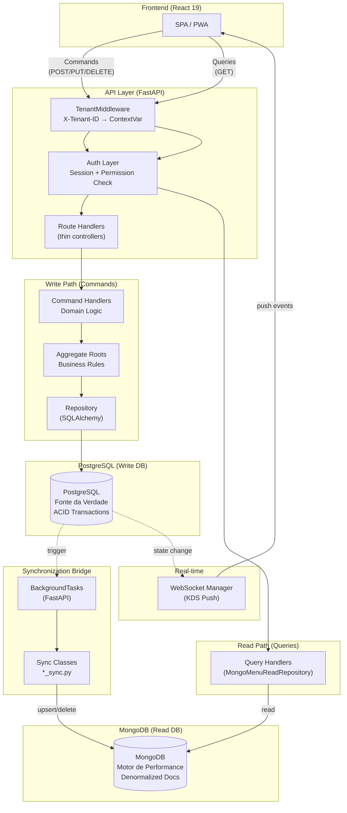

---

## 2. Write-Side: PostgreSQL como Fonte da Verdade

O **write-side** é o coração transacional do sistema. Toda mutação de estado — criar um pedido, adicionar um item ao estoque, processar um pagamento — passa pelo PostgreSQL via **Command Handlers** que orquestram **Aggregate Roots** e **Domain Events**.

### 2.1. Modelo de Dados Completo (PostgreSQL)

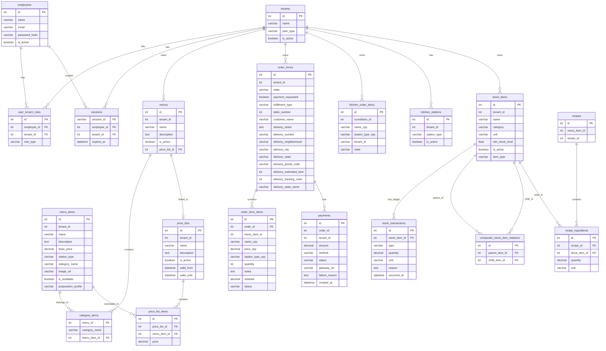

### 2.2. Schema Detalhado por Contexto

#### 2.2.1. AUTH Context — 4 Tabelas

| Tabela | Colunas | Propósito |
|:---|:---|:---|
| `tenants` | `id`, `name`, `plan_type` (BASIC/PRO/PLUS), `is_active` | Franquias/restaurantes |
| `employees` | `id`, `name`, `email`, `password_hash`, `is_active` | Funcionários |
| `user_tenant_roles` | `id`, `employee_id` FK, `tenant_id` FK, `role_type` | MapeamentoEmployee→Tenant |
| `sessions` | `session_id` (token URL-safe), `employee_id` FK, `tenant_id` FK, `expires_at` | Sessões stateful |

**Detalhes de Segurança:**
- Senhas: PBKDF2-SHA256, 100.000 iterações, salt aleatório por senha
- Sessões: `secrets.token_urlsafe(32)`, expira em 60 minutos
- Tokens: Bearer header (não JWT — sessões são armazenadas no banco)

#### 2.2.2. MENU Context — 5 Tabelas

| Tabela | Colunas | Propósito |
|:---|:---|:---|
| `menus` | `id`, `tenant_id`, `name`, `description`, `is_active`, `price_list_id` | Cardápios visuais |
| `menu_items` | `id`, `tenant_id`, `name`, `description`, `base_price`, `station_type`, `category_name`, `image_url`, `is_available`, `preparation_profile` | Catálogo de produtos |
| `category_items` | `menu_id` FK, `category_name`, `menu_item_id` FK | Junção N:M Menu↔MenuItem |
| `price_lists` | `id`, `tenant_id`, `name`, `description`, `is_active`, `valid_from`, `valid_until` | Listas de preço |
| `price_list_items` | `id`, `price_list_id` FK, `menu_item_id` FK, `price` | Preços por item |

**PreparationProfile (Enum):**
| Valor | Comportamento no KDS |
|:---|:---|
| `STANDARD` | Waiting → Preparing → Ready (itens cozinhados) |
| `NO_PREP` | Waiting → Ready direto (bebidas engarrafadas) |

**Relação Menu↔MenuItem (N:M):**
- `category_items` é a tabela junction que permite um mesmo MenuItem estar em múltiplos Cardápios
- Cada MenuItem tem uma `category_name` por cardápio

#### 2.2.3. ORDER Context — 2 Tabelas

| Tabela | Colunas | Propósito |
|:---|:---|:---|
| `order_forms` | `id`, `tenant_id`, `state`, `payment_requested`, `fulfillment_type`, `table_number`, `customer_name`, `delivery_*` | Comanda (pedido) |
| `order_form_items` | `id`, `order_id` FK, `menu_item_id`, `name_cpy`, `price_cpy`, `station_type_cpy`, `quantity`, `notes`, `subtotal`, `status` | Itens da comanda |

**Snapshot Pattern:**
Os campos `name_cpy`, `price_cpy`, `station_type_cpy` são **snapshots** do MenuItem no momento da criação. Garante que o histórico não mude se o cardálio for alterado.

**Máquina de Estados (OrderForm):**

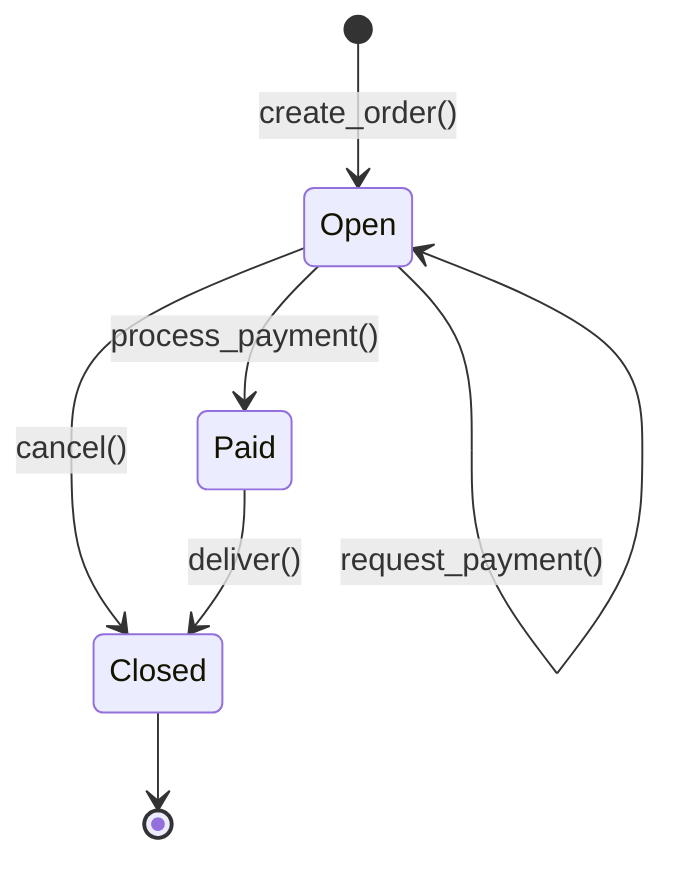

**Fulfillment Strategy Pattern:**

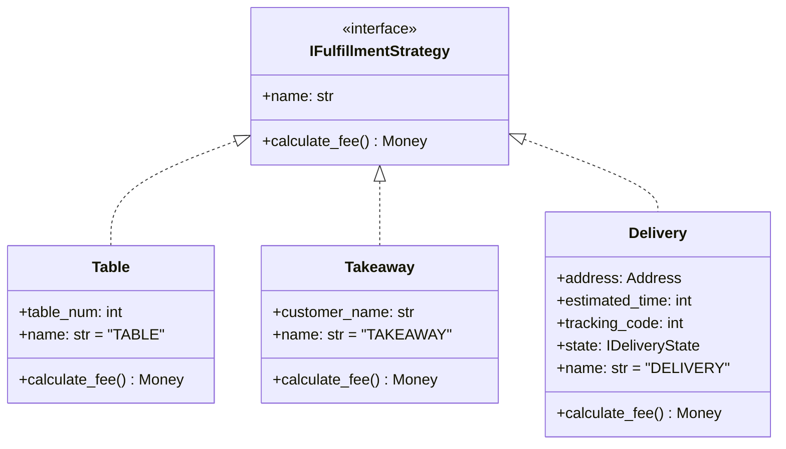

**Máquina de Estados (Delivery):**

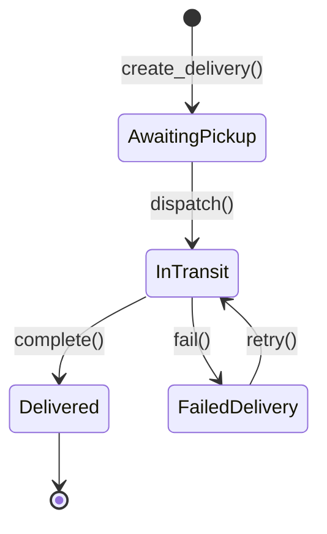

#### 2.2.4. KITCHEN Context — 2 Tabelas

| Tabela | Colunas | Propósito |
|:---|:---|:---|
| `kitchen_order_items` | `id`, `correlation_id`, `name_cpy`, `station_type_cpy`, `tenant_id`, `state` | Itens no KDS |
| `kitchen_stations` | `id`, `tenant_id`, `station_type` (GRILL/BEVERAGE), `is_active` | Estações de preparo |

**Máquina de Estados (KitchenOrderItem):**

```mermaid
stateDiagram-v2
    [*] --> Waiting : receive_item()
    Waiting --> Preparing : prepare()
    Preparing --> Ready : mark_as_ready()
    Waiting --> Cancelled : cancel()
    Preparing --> Cancelled : cancel()

    note right of Waiting : STANDARD: aguarda prepare()
    note right of Waiting : NO_PREP: mark_as_ready() direto

    Waiting --> Ready : mark_as_ready()<br/>[NO_PREP only]
```

**State Pattern Implementation:**

```python
# domain/states.py
class IKitchenItemState(ABC):
    @abstractmethod
    def prepare(self, item: KitchenOrderItem) -> None: ...

    @abstractmethod
    def mark_as_ready(self, item: KitchenOrderItem) -> None: ...

    @abstractmethod
    def cancel(self, item: KitchenOrderItem) -> None: ...

class Waiting(IKitchenItemState):
    def prepare(self, item: KitchenOrderItem) -> None:
        item._state = Preparing()

    def mark_as_ready(self, item: KitchenOrderItem) -> None:
        raise ValueError("Cannot mark ready from waiting")

    def cancel(self, item: KitchenOrderItem) -> None:
        item._state = Cancelled()

class Preparing(IKitchenItemState):
    def prepare(self, item: KitchenOrderItem) -> None:
        raise ValueError("Item is already being prepared")

    def mark_as_ready(self, item: KitchenOrderItem) -> None:
        item._state = Ready()

    def cancel(self, item: KitchenOrderItem) -> None:
        item._state = Cancelled()
```

#### 2.2.5. PAYMENT Context — 1 Tabela

| Tabela | Colunas | Propósito |
|:---|:---|:---|
| `payments` | `id`, `order_id`, `tenant_id`, `amount`, `method`, `status`, `gateway_ref`, `failure_reason`, `created_at` | Transações financeiras |

**Máquina de Estados (Payment):**

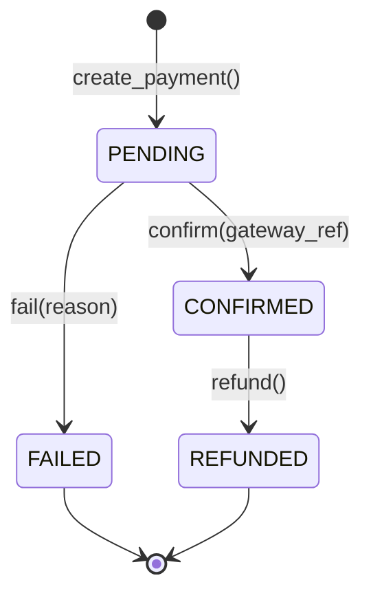

**Métodos de Pagamento:**
| Método | Gateway | Fluxo |
|:---|:---|:---|
| `CASH` | Local (sem Stripe) | Auto-confirmado, gateway_ref sintético |
| `CREDIT_CARD` | Stripe API | PaymentIntent → confirm → webhook |
| `DEBIT_CARD` | Stripe API | PaymentIntent → confirm → webhook |
| `PIX` | Stripe API (via PaymentIntent) | QR Code → confirmação |

#### 2.2.6. STOCK Context — 6 Tabelas

| Tabela | Colunas | Propósito |
|:---|:---|:---|
| `stock_items` | `id`, `tenant_id`, `name`, `category`, `unit`, `min_stock_level`, `is_active`, `item_type` | Itens de estoque |
| `stock_transactions` | `id`, `stock_item_id` FK, `type`, `quantity`, `unit`, `reason`, `occurred_at` | Ledger de transações |
| `composite_stock_item_relations` | `id`, `parent_item_id` FK, `child_item_id` FK | Relações compostas |
| `recipes` | `id`, `menu_item_id`, `tenant_id` | Receitas |
| `recipe_ingredients` | `id`, `recipe_id` FK, `stock_item_id` FK, `quantity`, `unit` | Ingredientes da receita |

**Composite Pattern:**

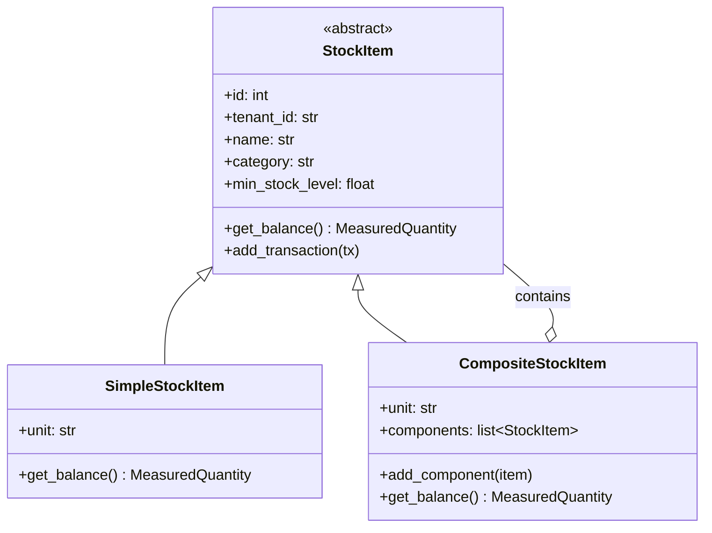

**Cálculo de Saldo (Ledger-based):**

```
Saldo = último ADJUSTMENT + Σ(INPUT, PRODUCTION) - Σ(OUTPUT, WASTE)
```

Para `CompositeStockItem`:
```
Saldo = Σ(balance de cada componente)
```

**MeasuredQuantity (Value Object):**

```python
@dataclass(frozen=True)
class MeasuredQuantity:
    amount: Decimal
    unit: str

    def add(self, other: MeasuredQuantity) -> MeasuredQuantity:
        # Converte automaticamente entre unidades compatíveis
        # Ex: 500g + 0.5kg = 1.0kg
        ...

    def subtract(self, other: MeasuredQuantity) -> MeasuredQuantity:
        # Valida saldo não-negativo
        ...
```

### 2.3. Command Handlers — Detalhamento

#### 2.3.1. Ordem de Execução de um Command

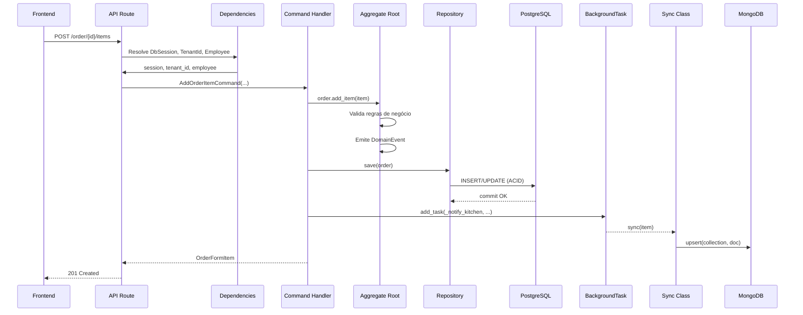

#### 2.3.2. Fluxo Completo: Criar Pedido + Notificar Cozinha

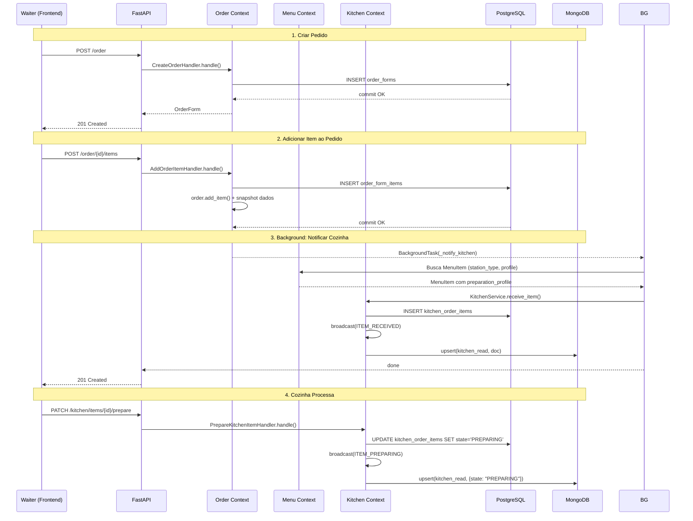

### 2.4. Stock/Recipe System — Detalhamento

#### 2.4.1. Fluxo de Produção (Receita)

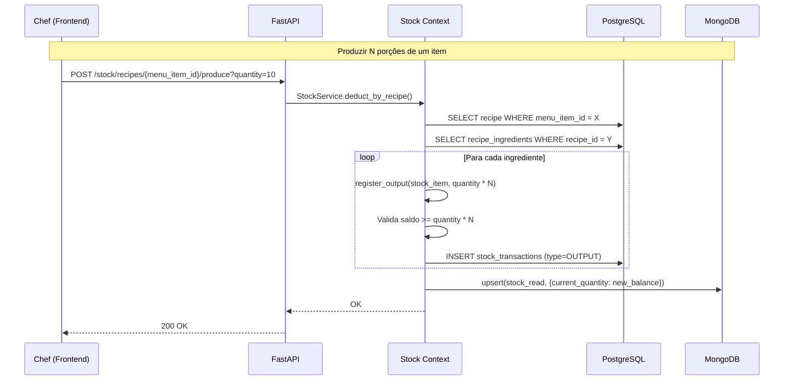

#### 2.4.2. Operações de Estoque

| Endpoint | Operação | Efeito |
|:---|:---|:---|
| `POST /stock/items` | Criar | Novo SimpleStockItem com transação INPUT inicial |
| `POST /stock/items/{id}/add` | Entrada | Adiciona transação INPUT ao ledger |
| `POST /stock/items/{id}/deduct` | Saída | Adiciona transação OUTPUT (valida saldo) |
| `POST /stock/items/{id}/adjust` | Ajuste | Adiciona transação ADJUSTMENT/PRODUCTION/WASTE |
| `PUT /stock/items/{id}/min-level` | Nível mínimo | Atualiza threshold de alerta |
| `GET /stock/items/{id}/movements` | Histórico | Retorna todas as transações do item |
| `PUT /stock/recipes/{id}` | Salvar receita | Cria/atualiza mapeamento MenuItem→Ingredientes |
| `POST /stock/recipes/{id}/produce` | Produzir | Deduz estoque conforme receita |

### 2.5. Payment/Stripe Integration

#### 2.5.1. Fluxo de Pagamento

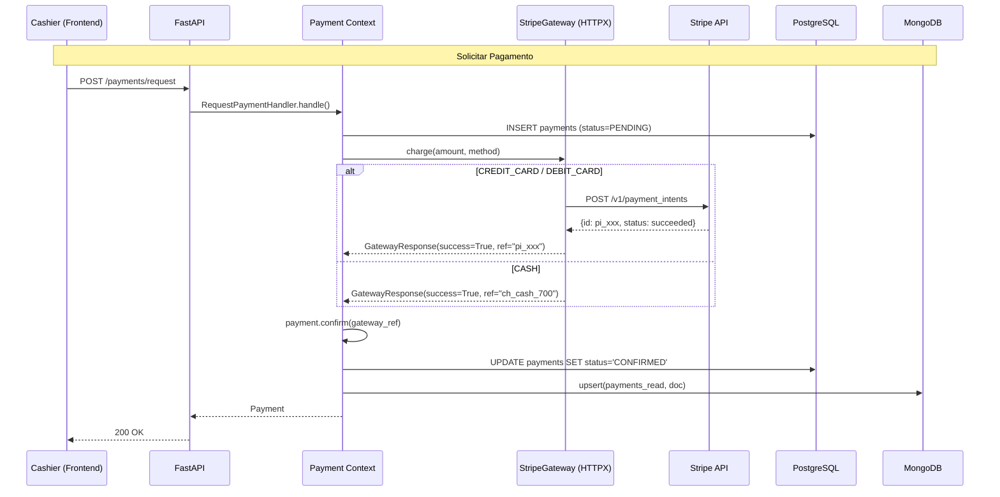

#### 2.5.2. Gateway Abstraction

```python
# domain/gateway.py
@runtime_checkable
class IPaymentGateway(Protocol):
    async def charge(self, amount: Money, method: PaymentMethod) -> GatewayResponse: ...
    async def refund(self, gateway_ref: str, amount: Money) -> GatewayResponse: ...

# infrastructure/stripe_gateway.py
class StripeGateway(IPaymentGateway):
    async def charge(self, amount: Money, method: PaymentMethod) -> GatewayResponse:
        if method == PaymentMethod.CASH:
            return GatewayResponse(success=True, gateway_ref=f"ch_cash_{int(amount.amount * 100)}")
        # POST /v1/payment_intents via HTTPX
        ...

    async def refund(self, gateway_ref: str, amount: Money) -> GatewayResponse:
        if gateway_ref.startswith("ch_cash_"):
            return GatewayResponse(success=True, gateway_ref=f"re_cash_{gateway_ref}")
        # POST /v1/refunds via HTTPX
        ...
```

### 2.6. Cross-Context Communication

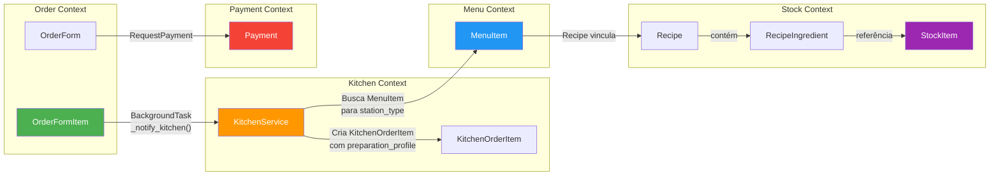

**Princípios de Comunicação:**
1. **Sem imports cross-context no domain layer** — comunicação é feita via BackgroundTasks na API layer
2. **Consistência eventual** — o MongoDB é atualizado após o commit no PostgreSQL
3. **Dados duplicados (snapshots)** — cada contexto mantém cópias dos dados que precisa
4. **IDs compartilhados** — Value Objects em `app/shared/` são usados como ponte entre contextos

---

## 3. Read-Side: MongoDB como Motor de Performance

O **read-side** é otimizado para consultas de alta performance. Dados são desnormalizados, pré-agregados e armazenados em coleções MongoDB que servem como "materialized views" do estado do sistema.

### 3.1. Coleções MongoDB — Esquema Completo

#### 3.1.1. `menu_read_models`

```json
{
  "_id": ObjectId,
  "menu_id": 1,
  "tenant_id": "franquia_001",
  "name": "Cardápio Principal",
  "description": "Nosso cardápio completo",
  "is_active": true,
  "price_list_id": 42,
  "items": [
    {
      "id": 101,
      "name": "Hambúrguer Clássico",
      "description": "Pão, carne, alface, tomate",
      "price": 28.90,
      "category": "Lanches",
      "image_url": "https://...",
      "is_available": true
    }
  ]
}
```

**Sync Class:** `MenuReadModelSync`  
**Trigger:** Após toda mutação de menu (criar, adicionar item, remover, toggle, deletar, vincular, atualizar preço)  
**Chave:** `menu_id`  
**Operação:** `replace_one` (upsert completo) — o documento é reconstruído do zero a cada sync

#### 3.1.2. `orders_read`

```json
{
  "_id": ObjectId,
  "order_id": 1001,
  "tenant_id": "franquia_001",
  "total": 57.80,
  "items": [
    {
      "id": 1,
      "menu_item_id": 101,
      "name_cpy": "Hambúrguer Clássico",
      "category": "Lanches",
      "price": 28.90,
      "quantity": 2,
      "subtotal": 57.80
    }
  ],
  "created_at": ISODate("2026-06-08T14:30:00Z")
}
```

**Sync Class:** `OrderReadModelSync`  
**Trigger:** Após `DeliverOrderHandler` (pedido fechado)  
**Chave:** `{order_id, tenant_id}` (compound)  
**Operação:** `replace_one` (upsert)

#### 3.1.3. `order_history`

```json
{
  "_id": ObjectId,
  "order_id": 1001,
  "tenant_id": "franquia_001",
  "state": "CLOSED",
  "total": 64.80,
  "fulfillment": {
    "type": "DELIVERY",
    "fee": 7.00,
    "delivery_street": "Rua A",
    "delivery_number": "123",
    "delivery_neighborhood": "Centro",
    "delivery_city": "São Paulo",
    "delivery_state": "SP",
    "delivery_postal_code": "01001-000",
    "delivery_estimated_time": 40,
    "delivery_tracking_code": 42,
    "delivery_state_name": "DELIVERED"
  },
  "items": [...],
  "closed_at": ISODate("2026-06-08T15:10:00Z")
}
```

**Sync Class:** `OrderHistoryMongoRepository` (dupla escrita junto com `orders_read`)  
**Trigger:** Após `DeliverOrderHandler`  
**Chave:** `order_id`  
**Queries:** `find_all_by_tenant()` retorna até 100 pedidos concluídos

#### 3.1.4. `kitchen_read`

```json
{
  "_id": ObjectId,
  "kitchen_item_id": 2001,
  "correlation_id": 2001,
  "tenant_id": "franquia_001",
  "name_cpy": "Hambúrguer Clássico",
  "station_type_cpy": "GRILL",
  "preparation_profile": "STANDARD",
  "state": "PREPARING",
  "started_at": ISODate("2026-06-08T14:31:00Z"),
  "completed_at": null,
  "created_at": ISODate("2026-06-08T14:30:00Z")
}
```

**Sync Class:** `KitchenReadModelSync`  
**Trigger:** Após cada transição de estado (receive, prepare, ready, cancel)  
**Chave:** `{kitchen_item_id, tenant_id}`  
**Lógica de Timestamps:**
- `started_at`: definido no primeiro estado não-WAITING via `$setOnInsert` (não sobrescrito)
- `completed_at`: definido em estados terminais (READY/CANCELLED) via `$set`

```python
# Implementação com $set / $setOnInsert
set_fields = {
    "correlation_id": item.correlation_id,
    "name_cpy": item.name_cpy,
    "station_type_cpy": item.station_type_cpy,
    "preparation_profile": item.preparation_profile,
    "state": state,
    "tenant_id": item.tenant_id,
}
if is_final:
    set_fields["completed_at"] = now

set_on_insert = {}
if is_preparing:
    set_on_insert["started_at"] = now

await collection.update_one(
    {"kitchen_item_id": item.id, "tenant_id": item.tenant_id},
    {"$set": set_fields, "$setOnInsert": set_on_insert},
    upsert=True,
)
```

#### 3.1.5. `payments_read`

```json
{
  "_id": ObjectId,
  "payment_id": 3001,
  "order_id": 1001,
  "tenant_id": "franquia_001",
  "amount": 64.80,
  "method": "CREDIT_CARD",
  "status": "CONFIRMED",
  "gateway_ref": "pi_3NqJZa2eZvKYlo2C0Xyz",
  "failure_reason": null,
  "created_at": ISODate("2026-06-08T15:05:00Z")
}
```

**Sync Class:** `PaymentReadModelSync`  
**Trigger:** Após request e refund de pagamento  
**Chave:** `payment_id`  
**Operação:** `replace_one` (upsert)

#### 3.1.6. `stock_read`

```json
{
  "_id": ObjectId,
  "stock_item_id": 4001,
  "tenant_id": "franquia_001",
  "name": "Pão de Hambúrguer",
  "category": "RAW_MATERIAL",
  "current_quantity": 150.0,
  "unit": "un",
  "min_stock_level": 50.0,
  "is_low_stock": false,
  "is_active": true
}
```

**Sync Class:** `StockReadModelSync`  
**Trigger:** Após toda mutação de estoque (criar, adicionar, deduzir, ajustar, alterar min-level, produzir)  
**Chave:** `{stock_item_id, tenant_id}`  
**Campo Derivado:** `is_low_stock = current_quantity < min_stock_level`

### 3.2. Mecanismo de Sincronização — A Ponte

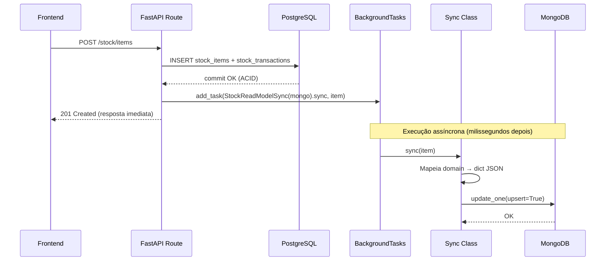

**Garantias do Padrão:**
1. **Resposta rápida** — o cliente recebe 201 antes do sync completar
2. **Consistência eventual** — MongoDB pode estar uns milissegundos defasado
3. **Tolerância a falhas** — se MongoDB estiver down, o PostgreSQL não afeta
4. **Sem polling** — sync é event-driven via BackgroundTasks

### 3.3. Detalhamento por Sync Class

#### 3.3.1. `MenuReadModelSync`

```python
class MenuReadModelSync:
    def __init__(self, mongo_db: AsyncIOMotorDatabase) -> None:
        self._collection = mongo_db["menu_read_models"]

    async def sync(self, menu_doc: dict[str, Any]) -> None:
        """Recebe um dicionário denormalizado do menu e upserta no MongoDB."""
        await self._collection.replace_one(
            {"menu_id": menu_doc["menu_id"], "tenant_id": menu_doc["tenant_id"]},
            menu_doc,
            upsert=True,
        )

    async def remove(self, menu_id: int) -> None:
        await self._collection.delete_one({"menu_id": menu_id})
```

**Resolução de Preço:** O documento é reconstruído com `_resolve_menu_doc()`:
1. Busca todos os `MenuItemORM` vinculados ao menu
2. Se o menu tem `price_list_id`, busca `PriceListItemORM` para overrides
3. Preço final = `price_override` se existe, senão `base_price`

#### 3.3.2. `OrderReadModelSync`

```python
class OrderReadModelSync:
    async def sync(self, order: OrderForm) -> None:
        doc = {
            "order_id": order.id,
            "tenant_id": order.tenant_id,
            "total": float(order.total().amount),
            "items": [
                {
                    "id": item.id,
                    "menu_item_id": item.menu_item_id,
                    "name_cpy": item.name_cpy,
                    "price": float(item.price_cpy.amount),
                    "quantity": item.quantity,
                    "subtotal": float(item.calculate_subtotal().amount),
                }
                for item in order.items
            ],
            "created_at": datetime.now(UTC),
        }
        await self._collection.update_one(
            {"order_id": order.id, "tenant_id": order.tenant_id},
            {"$set": doc},
            upsert=True,
        )
```

#### 3.3.3. `KitchenReadModelSync`

```python
class KitchenReadModelSync:
    async def sync(self, item: KitchenOrderItem) -> None:
        now = datetime.now(UTC)
        state = item.state.name

        is_preparing = state in ("PREPARING", "READY", "CANCELLED")
        is_final = state in ("READY", "CANCELLED")

        set_fields = {
            "correlation_id": item.correlation_id,
            "name_cpy": item.name_cpy,
            "station_type_cpy": item.station_type_cpy,
            "preparation_profile": item.preparation_profile,
            "state": state,
            "tenant_id": item.tenant_id,
        }

        if is_final:
            set_fields["completed_at"] = now

        set_on_insert = {}
        if is_preparing:
            set_on_insert["started_at"] = now

        await self._collection.update_one(
            {"kitchen_item_id": item.id, "tenant_id": item.tenant_id},
            {"$set": set_fields, "$setOnInsert": set_on_insert},
            upsert=True,
        )
```

**Proteção de `started_at`:** O uso de `$setOnInsert` garante que `started_at` só é definido uma vez (no primeiro update que não é WAITING). Transições posteriores não sobrescrevem o timestamp.

#### 3.3.4. `StockReadModelSync`

```python
class StockReadModelSync:
    async def sync(self, item: StockItem) -> None:
        balance = item.get_balance()
        doc = {
            "stock_item_id": item.id,
            "tenant_id": item.tenant_id,
            "name": item.name,
            "category": item.category,
            "current_quantity": float(balance.amount),
            "unit": balance.unit,
            "min_stock_level": item.min_stock_level,
            "is_low_stock": item.is_low_stock,
            "is_active": item.is_active,
        }
        await self._collection.update_one(
            {"stock_item_id": item.id, "tenant_id": item.tenant_id},
            {"$set": doc},
            upsert=True,
        )
```

**Campo Derivado `is_low_stock`:** Calculado em tempo de sync como `current_quantity < min_stock_level`. Reavaliado a cada 5 minutos via lifespan task.

### 3.4. WebSocket/KDS — Atualização em Tempo Real

#### 3.4.1. Arquitetura do KDS

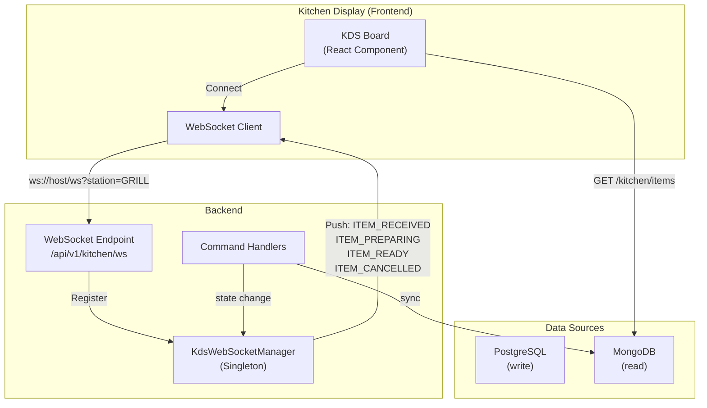

#### 3.4.2. Fluxo de Eventos WebSocket

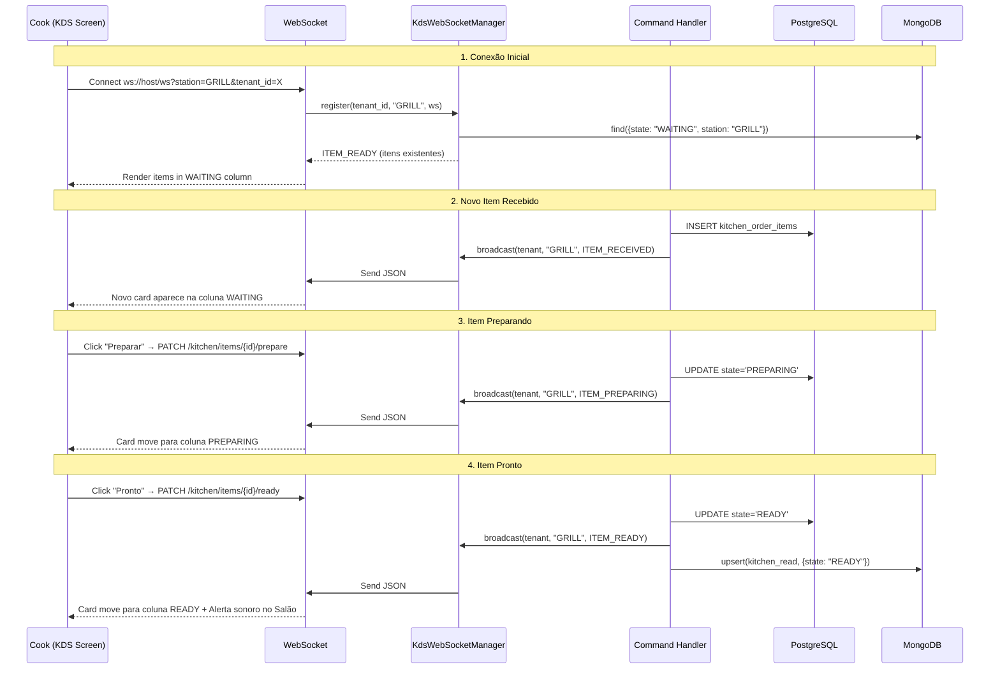

#### 3.4.3. KdsWebSocketManager — Implementação

```python
class KdsWebSocketManager:
    """Singleton que gerencia conexões WebSocket do KDS."""

    def __init__(self) -> None:
        # {tenant_id: {station_type: [WebSocket, ...]}}
        self._active_connections: dict[str, dict[str, list[WebSocket]]] = {}

    async def connect(self, websocket: WebSocket, tenant_id: str, station_type: str) -> None:
        await websocket.accept()
        tenant_conns = self._active_connections.setdefault(tenant_id, {})
        station_conns = tenant_conns.setdefault(station_type, [])
        station_conns.append(websocket)

    def disconnect(self, websocket: WebSocket, tenant_id: str, station_type: str) -> None:
        conns = self._active_connections.get(tenant_id, {}).get(station_type, [])
        if websocket in conns:
            conns.remove(websocket)

    async def broadcast_to_station(self, tenant_id: str, station_type: str, event_data: dict) -> None:
        conns = self._active_connections.get(tenant_id, {}).get(station_type, [])
        dead = []
        for ws in conns:
            try:
                await ws.send_json(event_data)
            except Exception:
                dead.append(ws)
        for ws in dead:
            conns.remove(ws)
```

#### 3.4.4. Reconexão com Exponential Backoff (Frontend)

```typescript
// KDS Board — reconexão automática
const MAX_RETRIES = 10;
const BASE_DELAY = 1000; // 1s

let retryCount = 0;
let ws: WebSocket | null = null;

function connect() {
  ws = new WebSocket(`ws://${host}/api/v1/kitchen/ws?station=${station}&tenant=${tenantId}`);

  ws.onopen = () => { retryCount = 0; };
  ws.onmessage = () => { refetchItems(); }; // Re-fetch via HTTP GET
  ws.onclose = () => {
    if (retryCount < MAX_RETRIES) {
      const delay = Math.min(BASE_DELAY * 2 ** retryCount, 30000);
      setTimeout(connect, delay);
      retryCount++;
    }
  };
}
```

### 3.5. Analytics — Agregações Cross-Collection

O contexto Analytics é **read-only** — não tem writes. Ele executa agregações MongoDB sobre múltiplas coleções:

```python
# Fluxo de dados para Analytics
orders_read ──┐
              ├──→ Aggregation Pipeline ──→ DashboardData
stock_read  ──┤
              ├──→ Aggregation Pipeline ──→ SalesReportData
kitchen_read ─┘
              └──→ Aggregation Pipeline ──→ KitchenPerformance
```

**Exemplo de Agregação — Dashboard:**

```python
async def get_dashboard(self, tenant_id: str, period: AnalyticsPeriod) -> DashboardData:
    # 1. Total de vendas (orders_read)
    pipeline = [
        {"$match": {"tenant_id": tenant_id, "created_at": {"$gte": start_date}}},
        {"$group": {"_id": None, "total": {"$sum": "$total"}, "count": {"$sum": 1}}},
    ]
    result = await self._orders_col.aggregate(pipeline).to_list(1)

    # 2. Tempo médio de preparo (kitchen_read)
    pipeline = [
        {"$match": {"tenant_id": tenant_id, "completed_at": {"$ne": None}}},
        {"$project": {"prep_time": {"$subtract": ["$completed_at", "$started_at"]}}},
        {"$group": {"_id": None, "avg_time": {"$avg": "$prep_time"}}},
    ]
    result = await self._kitchen_col.aggregate(pipeline).to_list(1)

    # 3. Itens com estoque baixo (stock_read)
    pipeline = [
        {"$match": {"tenant_id": tenant_id, "is_low_stock": True}},
        {"$count": "total"},
    ]
    result = await self._stock_col.aggregate(pipeline).to_list(1)
```

### 3.6. Consumo pelo Frontend

#### 3.6.1. Padrão de Requisição

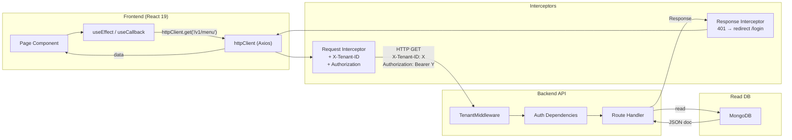

#### 3.6.2. Mapeamento de Rotas ↔ Componentes

| Rota | Componente | Dados Consumidos | Polling |
|:---|:---|:---|:---|
| `/orders` | `OrdersPage` + `OrderGrid` + `OrderDrawer` | `orders_read`, `menu_read_models` | 5s |
| `/kitchen` | `KitchenPage` + `KdsBoard` | `kitchen_read` | WebSocket |
| `/stock` | `StockPage` + `StockManager` | `stock_read` | On-demand |
| `/analytics` | `AnalyticsPage` + `AnalyticsDashboard` | Cross-collection aggregation | On-demand |
| `/menu-manager` | `MenuManagerPage` | `menu_read_models` | On-demand |
| `/history` | `HistoryPage` | `order_history` | On-demand |

#### 3.6.3. Estado no Frontend

| Camada | Tecnologia | Uso |
|:---|:---|:---|
| **Server State** | React Query | `useActiveMenu()` — cache 5min, 1 retry |
| **Auth State** | React Context | `AuthProvider` — session, employee, login/logout |
| **Tenant State** | React Context | `TenantProvider` — tenant_id via URL/localStorage |
| **Local UI State** | `useState`/`useCallback` | Orders, Kitchen items, Stock, Analytics, Modals |
| **Persistent State** | `localStorage` | `auth_token`, `tenant_id`, table timestamps |
| **Form State** | `useState` | Login, Menu CRUD, Employee CRUD, Stock actions |

### 3.7. PWA e Offline Support

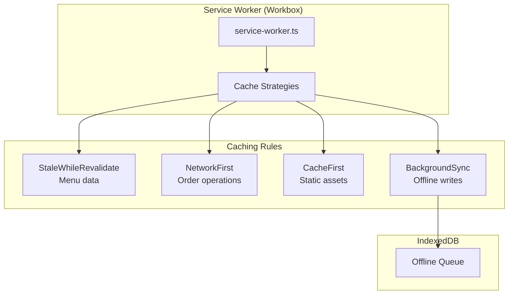

**Service Worker Strategies:**
| Recurso | Estratégia | Comportamento |
|:---|:---|:---|
| Menu data | StaleWhileRevalidate | Retorna cache imediato, revalida em background |
| Order operations | NetworkFirst | Tenta rede, fallback para cache |
| Static assets | CacheFirst | Sempre cache, fallback para rede |
| Offline writes | BackgroundSync | Enfileira requests, envia quando online |

---

## 4. Resumo dos Módulos Operacionais

| Módulo | Write DB | Read DB | Sync Trigger | WebSocket |
|:---|:---|:---|:---|:---|
| **Auth** | PostgreSQL | PostgreSQL (no sync) | N/A | N/A |
| **Menu** | PostgreSQL | `menu_read_models` | BackgroundTasks | N/A |
| **Order** | PostgreSQL | `orders_read` + `order_history` | BackgroundTasks | N/A |
| **Kitchen** | PostgreSQL | `kitchen_read` | BackgroundTasks | `kds_ws_manager` |
| **Payment** | PostgreSQL | `payments_read` | BackgroundTasks | N/A |
| **Stock** | PostgreSQL | `stock_read` | BackgroundTasks | N/A |
| **Analytics** | N/A (read-only) | Cross-collection aggregation | N/A | N/A |

---

## 5. Conclusão

A arquitetura CQRS do ComandaFacil separa fisicamente as responsabilidades de escrita e leitura:

- **Write-side (PostgreSQL):** Garante integridade ACID, transações atômicas e regras de negócio via Domain-Driven Design. Cada Bounded Context é independente, comunicando-se via BackgroundTasks e Domain Events.

- **Read-side (MongoDB):** Fornece consultas de alta performance com dados desnormalizados, pré-agregados e otimizados para cada caso de uso (dashboards, KDS, histórico).

- **Bridge (BackgroundTasks):** A sincronização é assíncrona e tolerante a falhas, garantindo que a operação do restaurante nunca pare por indisponibilidade do motor de leitura.

- **Real-time (WebSocket):** O KDS recebe atualizações push em tempo real, com reconexão automática via exponential backoff.

Esta separação permite escalar leituras e escritas independentemente, mantendo a consistência eventual como trade-off aceitável para alta disponibilidade e performance.

---

*Documento gerado como referência técnica definitiva do ecossistema ComandaFacil.*
